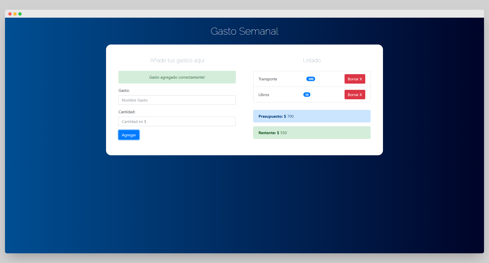

# Budget manager app
## Table of contents

- [Overview](#overview)
  - [The Challenge](#The-Challenge)
  - [Screenshot](#screenshot)
  - [Links](#links)
- [My process](#my-process)
  - [Built with](#built-with)
- [Author](#author)

## Overview
### The Challenge
- In this proyect the user should be able to add items the list and delete it. This list is limited by a number that the user chooses as budget through the prompt. The user cannot exceed the budget, which will be updated when expenses are added. If the user spends more than 50% of the budget, the updated budget will have a yellow background and if the user spends more than 75% of the budget will have a red background. When items are removed from the list the expense will be refunded and de budget will be updated.

### Screenshot

### Links

- Live Site URL: [Live Site](https://gonzalo-gauna-budget-manager-app.netlify.app/)

## My process
- I lern and practice javascript class.

### Built with

- Semantic HTML5 markup
- Bootstrap
- Javascript
- Responsive Design

## Author

- Twitter - [@gonzalogaunaDev](https://twitter.com/gonzalogaunaDev)